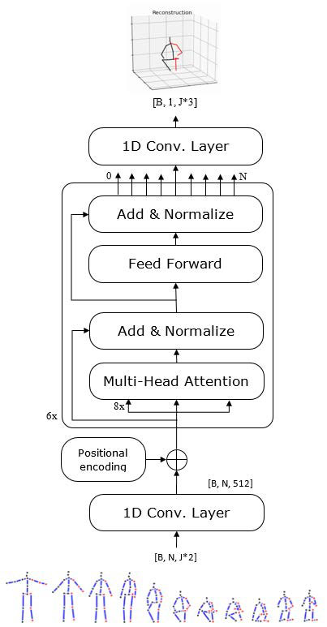
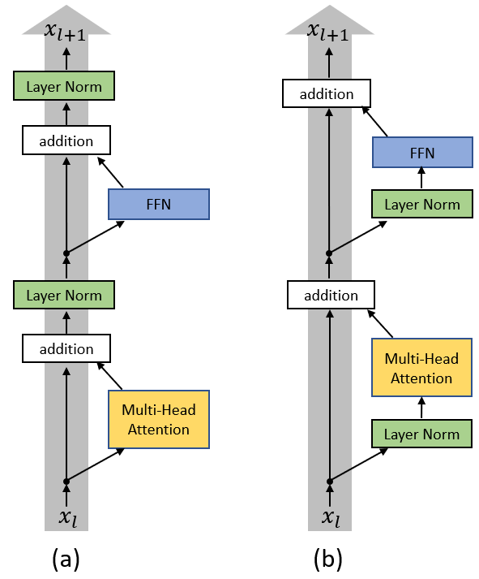

# Simulation

Pour le pôle simulation, nous voulions faire un programme qui puisse trouver et animer les positions des articulations du squelette d'un coureur en entrant une vidéo de lui. Après analyse, nous avons décidé d'utiliser une approche d'apprentissage profond pour résoudre ce problème. Ce programme est divisé en 5 parties:

1. Décoder une vidéo
2. Trouver boîte englobante (bounding box) par **YOLO**.
3. Trouver la position des articulations de coureur par **HRNet**.
4. Transformaer les coordonnées de position des articulations en 3D par **GAST-Net** ou **LiftFormer** (à comparer leur performance).
5. Projeter des coordonnées et générer des animations.

# 1. Décoder une vidéo

Pas encore effectuer.

# 2. Bounding box (**YOLO**)

Pas encore effectuer.

# 3. Détection de la position des articulations (**HRNet**)

Pas encore effectuer.

# 4. Transformation des coordonnées en 3D

## 4.1 Problématique

Dans la section précédente, nous avons obtenu des informations sur les coordonnées des articulations du coureur en deux dimensions. Nous aimerions l'utiliser comme entrée pour déduire les coordonnées en trois dimensions.

## 4.2 Dataset

Nous avons choisi Human3.6M comme jeu de données pour l'entraînement et l'évaluation du réseau. Human3.6M est composé de 3,6 millions d'images de 11 sujets différents. sujets différents, mais seulement 7 d'entre eux sont annotés. Les sujets sujets ont effectué jusqu'à 15 types d'actions différentes, qui ont été enregistrées depuis 4 points de vue différents. Nous nous entraînons sur 17 joints avec les sujets S1, S5, S6, S7 et S8. L'évaluation est faite sur S9 et S11.

Nous avons téléchargé les données des points de coordonnées 3D de l'articulation, ainsi que les paramètres des quatre caméras. Nous projetons le système de coordonnées du monde en 3D sur le système de coordonnées de la caméra en 2D pour obtenir les coordonnées des articulations en 2D. Enfin, pour les coordonnées de chaque articulation, nous avons calculé l'écart-type et la variance afin de normaliser les données.

## 4.3 Métrique

Pour quantifier la performance du réseau, nous avons choisi le **MPJPE (Mean Per Joint Position Error)** comme métrique.

Pour une trame f et un squelette S, MPJPE est calculée comme

$$
E_{MPJPE}(f, \mathcal{S})=\frac{1}{N_{\mathcal{S}}} \sum_{i=1}^{N_{\mathcal{S}}} \| m_{\mathbf{f}, \mathcal{S}}^{(f)}(i)-m_{\mathbf{g t}, \mathcal{S}}^{(f)}(i) \|_{2}
$$

où $N_S$ est le nombre d'articulations du squelette $S$. Pour un ensemble de trames ensemble d'images, l'erreur est la moyenne des MPJPE de toutes les images.

## 4.4 GAST-Net

Pas encore effectuer.

## 4.5 LiftFormer

Dans cette section, nous essayons de reproduire le code du thèse *LiftFormer: 3D Human Pose Estimation using attention models*[^LiftFormer].

### 4.5.1 Méthod  

LiftFormer utilise Transformer[^Transformer] comme réseau de base, c'est-à-dire les couches cachées de 512 dimensions, les multi-attention de 8 heads et 6 blocs encodeurs. L'idée générale est de faire passer des séquences de points clés 2D par plusieurs blocs d'encodage Transformer pour générer une prédiction de pose 3D, correspondant au centre de la séquence d'entrée/du champ récepteur, puis de répéter le processus pour tous les pas de temps à la manière d'une fenêtre glissante. Ainsi, pendant l'apprentissage, le modèle exploite les données temporelles des images passées et futures pour pouvoir créer des prédictions cohérentes dans le temps.



Certaines modifications doivent avoir lieu pour que la dimensionnalité d'entrée et de sortie corresponde. Ainsi, l'entrée du Transformer Encoder est reprojetée d'une dimension d'entrée de [N, 34] à [N, 512], où N est le champ réceptif et 34 correspond à 17 articulations fois 2 (nombre de coordonnées). La raison est que la dimension d'entrée correspond à celle des couches cachées situées à l'intérieur du bloc Transformer Encoder. 

Ensuite, l'encodage temporel est agrégé en ajoutant un vecteur aux embeddings d'entrée. Ceci afin que le modèle puisse utiliser l'ordre temporel dans la séquence. Dans l'article original de Transformer, il est fait référence à l'encodage positionnel qui est utilisé pour injecter des informations sur la position relative ou absolue des tokens dans la séquence. En utilisant des fonctions sinus et cosinus pour créer ces enchâssements temporels qui sont ensuite additionnés aux entrées reprojetées. Les embeddings temporels injectés doivent donc avoir la même dimensionnalité que les entrées. Les caractéristiques résultantes sont ensuite envoyées au Transformer Encoder, qui les traite.

$$
\text{PE}(pos,2i)=sin\left(\frac{pos}{10000^{2i/d_{model}}}\right),
$$

$$
\text{PE}(pos,2i+1)=cos\left(\frac{pos}{10000^{2i/d_{model}}}\right).
$$

Puisque la partie Décodeur du Transformateur n'est pas utilisée, et en raison des connexions résiduelles dans l'auto-attention, la dimension de la sortie sera exactement la même que celle de l'entrée, c'est-à-dire [N, 512]. Le milieu du champ réceptif est la sortie finale. Ceci est dû au fait que pendant l'entraînement, la moitié du champ réceptif correspond aux poses passées, et l'autre moitié aux poses futures. La pose centrale dans le champ réceptif est exactement la pose que nous essayons de trouver.

Enfin, nous reprojetons les embeddings de sortie en 3 dimensions, de [1, 512] à [1, 51] en utilisant à nouveau une couche convolutive 1D, où 51 correspond à 17 articulations fois 3 (coordonnées x, y et z). La perte est ensuite calculée en utilisant MPJPE par rapport aux vérités de base 3D des ensembles de données et l'erreur est rétro-propagée.

Il est indiqué que la partage entre les paramètres des couches permet de construire des modèles plus efficaces tout en conservant la précision [^Albert]. Ils montrent que le partage de tous les paramètres de chaque bloc de l'encodeur, ou seulement des paramètres du FFN, nuit considérablement aux performances globales. D'autre part, le partage des paramètres des couches d'attention uniquement semble affecter à peine la précision finale et, dans certains cas, l'améliorer. Dans tous les cas, le nombre total de paramètres est considérablement réduit. Dans notre code, nous nous assurons que les paramètres sont partagés en utilisant plusieurs fois la même couche d'attention.

```python
class Encoder(nn.Module):
    ''' Encoder with weight-shared self attention'''
    def __init__(self, ...):

        super().__init__()
        self.n_layers = n_layers
        self.slf_attn = MultiHeadAttention(...)
        self.pos_ffn = clones(PositionwiseFeedForward(...)

    def forward(self, x, src_mask=None):

        for i in range(self.n_layers):
            x = self.slf_attn(x, ...)
            x = self.pos_ffn[i](x)

        return x
```

Un point à noter est que lorsque nous avons entraîné le réseau, nous avons constaté qu'il convergeait lentement et avec de mauvaises métriques. Nous avons modifié la position des couches **layer normalisation** sur la base des recherches existantes [^PreLN]. Nos expériences montrent que cette amélioration basée sur Liftformer donne de meilleurs résultats.



### 4.5.2 Expériences


Pour accélérer l'apprentissage et l'exploitation du modèle, nous avons choisi un champ perceptif de 27. (Détail à compléter...). Nos résultats (MPJPE en mm) sont les suivants.

Table: Expériences résultat

| Actions      | Liftformer | Liftformer w/ PreLN |
| ------------ | ---------- | ------------------- |
| Directions   | 33.9       | **31.3**            |
| Discussion   | 40.9       | **39.1**            |
| Eating       | 40.6       | **34.5**            |
| Greeting     | 38.0       | **35.3**            |
| Phoning      | 45.4       | **38.7**            |
| Photo        | 59.1       | **51.0**            |
| Posing       | 38.3       | **37.0**            |
| Purchases    | 34.5       | **34.0**            |
| Sitting      | 59.8       | **53.1**            |
| SittingDown  | 62.3       | **52.6**            |
| Smoking      | 41.7       | **37.4**            |
| Waiting      | 45.4       | **43.8**            |
| WalkDog      | 41.9       | **38.8**            |
| Walking      | 31.4       | **31.1**            |
| WalkTogether | 33.3       | **32.1**            |
| Average      | 43.1       | **39.3**            |

[^LiftFormer]: Llopart, A. (2020). LiftFormer: 3D Human Pose Estimation using attention models. arXiv preprint arXiv:2009.00348.

[^Transformer]: Vaswani, A., Shazeer, N., Parmar, N., Uszkoreit, J., Jones, L., Gomez, A. N., ... & Polosukhin, I. (2017). Attention is all you need. In Advances in neural information processing systems (pp. 5998-6008).

[^Albert]: Lan, Z., Chen, M., Goodman, S., Gimpel, K., Sharma, P., & Soricut, R. (2019). Albert: A lite bert for self-supervised learning of language representations. arXiv preprint arXiv:1909.11942.

[^PreLN]: Xiong, R., Yang, Y., He, D., Zheng, K., Zheng, S., Xing, C., ... & Liu, T. (2020, November). On layer normalization in the transformer architecture. In International Conference on Machine Learning (pp. 10524-10533). PMLR.